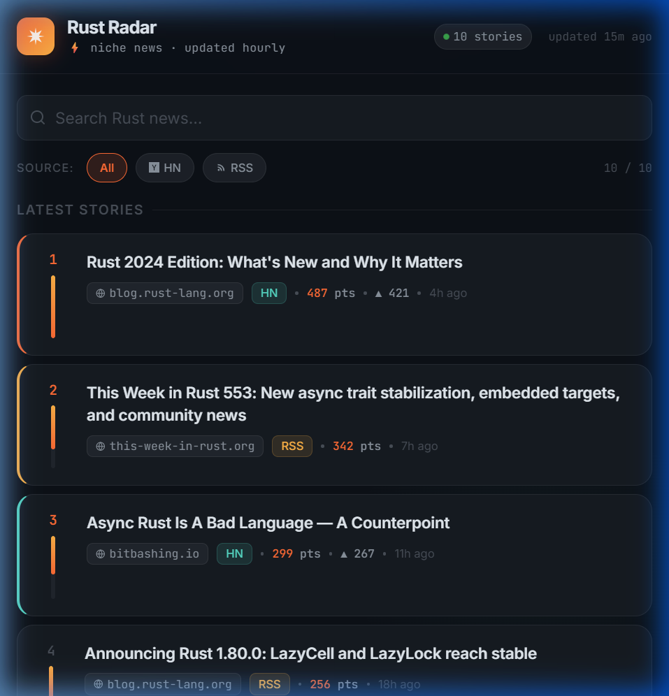

# 🦀 Rust Radar

> A minimalist, HN-style news aggregator for the Rust programming community.
> Swap the config to track AI, Web3, or any other niche in minutes.



---

## What's Inside

```
.
├── site/               ← Static frontend (deploy anywhere, zero backend)
│   ├── index.html      ← Premium dark UI
│   ├── style.css       ← Full design system (glassmorphism, tokens, animations)
│   ├── app.js          ← Vanilla JS: render, search, filter
│   └── data.json       ← Written by scraper; committed hourly by CI
│
├── scraper/
│   ├── config.py       ← Edit this to change the niche
│   ├── scrape.py       ← RSS + HN Algolia → data.json
│   └── requirements.txt
│
├── notify/
│   ├── post_digest.py             ← One-shot webhook (Discord + Slack)
│   ├── discord_bot_persistent.py  ← Always-on bot (optional)
│   └── requirements-bot.txt
│
└── .github/workflows/
    ├── hourly-scrape.yml   ← Scrape + commit every hour
    └── daily-digest.yml    ← Post top-3 digest at 08:00 UTC
```

---

## Quickstart (local)

```bash
# 1. Install scraper deps
cd scraper
pip install -r requirements.txt

# 2. Run the scraper → writes ../site/data.json
python scrape.py

# 3. Preview the site (fetch() needs an HTTP server)
cd ../site
python -m http.server 8000
# → open http://localhost:8000
```

Open `site/index.html` directly in a browser — the sample `data.json` is
already included, so the UI works immediately even without running the scraper.

---

## Changing the Niche

Edit **`scraper/config.py`**:

```python
# Any RSS/Atom feed URLs, with a per-source weight
RSS_SOURCES = [
    ("https://blog.rust-lang.org/feed.xml", 2.0),
    ("https://this-week-in-rust.org/rss.xml", 2.0),
    ...
]

# The HN Algolia search term
HN_ALGOLIA_QUERY = "rust programming language"

# Label shown in the UI and digest
NICHE_LABEL = "Rust"
```

Everything else — scoring, dedupe, JSON schema, frontend, digest bot — is
niche-agnostic. Examples: `"web3"`, `"llm"`, `"golang"`, `"devops"`.

---

## Scoring

| Source | Formula |
|--------|---------|
| **RSS** | `weight × 100 × 0.5^(age_h / 24)` — freshness-decayed, source-weighted |
| **HN**  | `3.0 × hn_points + 50 × 0.5^(age_h / 12)` — real upvotes + freshness bonus |

Stories are deduplicated by normalized URL (no query string / fragment).
The frontend **heat bar** = `story.score / top_story.score`.

---

## Deploying the Site

### GitHub Pages (recommended)
1. Push this repo to GitHub
2. Settings → Pages → Source: **Deploy from a branch** → `main` / `site` folder
3. The hourly workflow keeps `data.json` fresh; Pages redeploys automatically.

### Any static host
Upload the `site/` folder — Netlify, Vercel, Cloudflare Pages, S3 + CloudFront, etc.
No server required.

---

## Automating the Scraper

### GitHub Actions (no server needed)
`.github/workflows/hourly-scrape.yml` — runs `scrape.py` every hour and
commits the refreshed `data.json` back to the repo.

> Enable under **Actions** tab → allow workflows.

### Plain cron (self-hosted)
```bash
0 * * * *  cd /path/to/rust-radar/scraper && python scrape.py
```

---

## Daily Digest Notifications

### Option A — Webhook + cron (recommended)

1. **Discord**: Server Settings → Integrations → Webhooks → copy URL
2. **Slack**: Create an *Incoming Webhook* at api.slack.com/apps
3. Add as repo secrets:
   - `DISCORD_WEBHOOK_URL`
   - `SLACK_WEBHOOK_URL`
4. `.github/workflows/daily-digest.yml` runs `notify/post_digest.py` at **08:00 UTC** daily.

To change the time, edit the cron expression:
```yaml
- cron: '0 8 * * *'   # 08:00 UTC
# Examples:
# '0 13 * * *'  → 08:00 EST (UTC-5)
# '0 22 * * *'  → 08:00 JST (UTC+9, previous day)
```

Run locally:
```bash
export DISCORD_WEBHOOK_URL=https://discord.com/api/webhooks/...
export SLACK_WEBHOOK_URL=https://hooks.slack.com/services/...
python notify/post_digest.py
```

### Option B — Persistent Discord bot

Use `notify/discord_bot_persistent.py` for an always-online bot user:

```bash
cd notify
pip install -r requirements-bot.txt
export DISCORD_BOT_TOKEN=...
export DISCORD_CHANNEL_ID=...
export DIGEST_TZ=America/New_York   # optional, default UTC
export DIGEST_HOUR=8                # optional, default 8
python discord_bot_persistent.py
```

> **Note:** Needs a host that runs continuously — a VPS, Fly.io, Railway, etc.
> GitHub Actions is not suitable for always-on processes.

---

## Environment Variables Reference

| Variable | Used in | Description |
|----------|---------|-------------|
| `DISCORD_WEBHOOK_URL` | `post_digest.py`, Actions | Discord incoming webhook URL |
| `SLACK_WEBHOOK_URL` | `post_digest.py`, Actions | Slack incoming webhook URL |
| `DISCORD_BOT_TOKEN` | `discord_bot_persistent.py` | Bot token from Discord Developer Portal |
| `DISCORD_CHANNEL_ID` | `discord_bot_persistent.py` | Target channel snowflake ID |
| `DIGEST_TZ` | `discord_bot_persistent.py` | Timezone string (e.g. `America/New_York`) |
| `DIGEST_HOUR` | `discord_bot_persistent.py` | Hour to post (0–23, default `8`) |
| `DIGEST_TOP_N` | both notify scripts | Stories to include (default `3`) |
| `DIGEST_NICHE` | both notify scripts | Override niche label in messages |

---

## License

MIT — do whatever you want, attribution appreciated. 🦀
